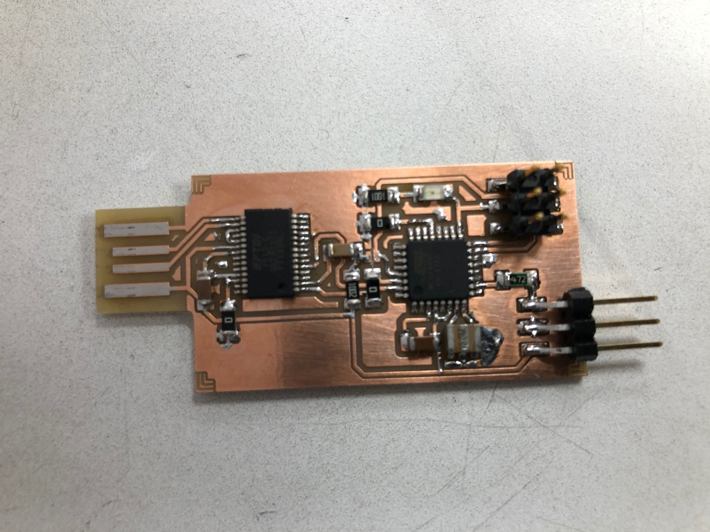

# Description
This board is a updi programmer that utilizes Arduino IDE to program AVR microcontroller.

# Instructions
* Use the Eagle files included in order to create the board to mill. In addition, the '.png' files to be used with [mods](http://mods.cba.mit.edu/) are included.
 
## Files
* [Eagle Board file](updi_programmer.brd)
* [Eagle Schematics file](updi_programmer.sch)
* [Components](updi_programmer_components.jpg)
* [Interior](updi_programmer_outline.png)
* [Traces](updi_programmer_traces.png)
* [Calibration](updi_programmer_calib.png)
## Milling
For milling we use a Roland SRM-20 with a 0.2-0.5 mm V-milling bit. The (updi_programmer_calib)[calibration file] was used for calibrating the milling depth to reach the correct milling width with a V-shape milling bit. 

When calculating the toolpaths with [mods](http://mods.cba.mit.edu/) We used 0.23 mm as the tool width for traces and calibration and 1 mm for the outline.

## Board dimensions:
*dpi*: 2400

*px*: 5932 x 2575

*mm*: 62.780 x 27.252

*in*: 2.472 x 1.073

# Links
* We followed the tutorials found at in:
  * [https://github.com/SpenceKonde/megaTinyCore/blob/master/MakeUPDIProgrammer.md](https://github.com/SpenceKonde/megaTinyCore/blob/master/MakeUPDIProgrammer.md)
  * [https://www.pcbway.com/project/shareproject/A_USB_stick_sized_UPDI_programmer.html](https://www.pcbway.com/project/shareproject/A_USB_stick_sized_UPDI_programmer.html)
  * [https://github.com/ElTangas/jtag2updi](https://github.com/ElTangas/jtag2updi)
  * [https://www.electronics-lab.com/project/getting-started-with-the-new-attiny-chips-programming-the-microchips-0-series-and-1-series-attiny-with-the-arduino-ide/](https://www.electronics-lab.com/project/getting-started-with-the-new-attiny-chips-programming-the-microchips-0-series-and-1-series-attiny-with-the-arduino-ide/)

# Authors
* Antti Mäntyniemi: antti.mantyniemi@oulu.fi

